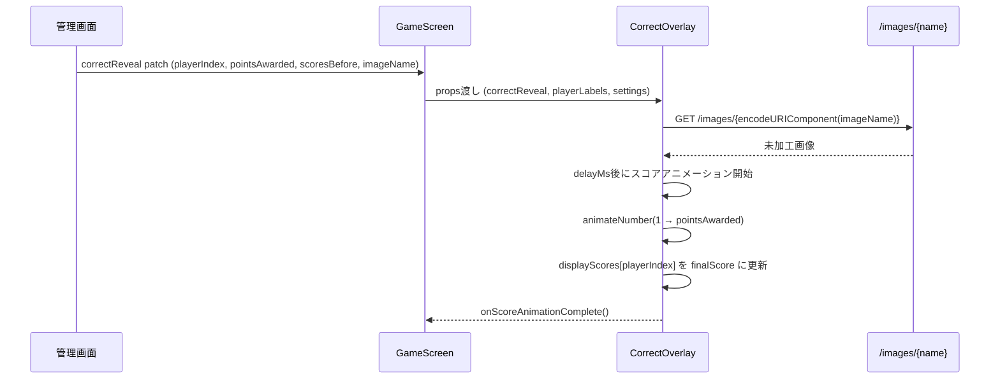

# Design Document: CorrectOverlay レイアウトリデザイン

## Overview

文化祭イントロクイズゲームの正解時オーバーレイ（`CorrectOverlay.jsx`）を、現行の中央1カードレイアウトから「左カラム（画像＋正解テキスト）」「右カラム（正解者名＋獲得点数）」「下エリア（全スコア推移）」の3エリア構成にリデザインする。
同時に `GameScreen.jsx` 側で `correctReveal` に `imageName` を含めるよう修正し、未加工画像の表示を可能にする。

## Architecture

```mermaid
graph TD
    GS[GameScreen.jsx] -->|correctReveal + imageName| CO[CorrectOverlay.jsx]
    CO --> LC[左カラム: 画像 + 正解テキスト]
    CO --> RC[右カラム: 正解者名 + 獲得点数アニメ]
    CO --> BA[下エリア: 全スコアリスト]
    CO --> CF[Confetti]
    GS -->|/images/{imageName}| BE[Backend: backend/images/]
```

## Sequence Diagrams

### 正解オーバーレイ表示フロー



## Components and Interfaces

### CorrectOverlay

**Purpose**: 正解時のフルスクリーンオーバーレイ。3エリア構成で情報を提示する。

**Props Interface**:
```javascript
// CorrectOverlay props（変更なし、imageName は correctReveal 内に含む）
{
  playerLabels: string[],           // ['P1', 'P2', 'P3', 'P4', 'P5']
  correctReveal: {
    playerIndex: number,            // 正解者インデックス
    pointsAwarded: number,          // 獲得点数
    scoresBefore: number[],         // 正解前スコア配列
    id: string,                     // ユニークID（key用）
    imageName: string | null,       // ← 追加: 現在の出題画像ファイル名
  },
  settings: object,                 // ゲーム設定
  onScoreAnimationComplete: () => void,
}
```

**Responsibilities**:
- 左カラム: `/images/{imageName}` から未加工画像を取得・表示、拡張子除去した画像名を正解として大表示
- 右カラム: 正解者名（大）、獲得点数アニメーション（中）
- 下エリア: 全プレイヤーのスコア推移リスト（正解前→正解後、正解者ハイライト）
- Confetti: 維持
- `onScoreAnimationComplete` コールバック呼び出し

### GameScreen（修正箇所）

**Purpose**: `correctReveal` を patch する際に `imageName` を含める。

**変更点**:
```javascript
// AdminScreen.jsx または app.py 側で correctReveal を設定する箇所で
// imageName: effectiveImage を追加する
correctReveal: {
  playerIndex,
  pointsAwarded,
  scoresBefore: state.scores,
  id: generateId(),
  imageName: state.currentImage,  // ← 追加
}
```

## Data Models

### correctReveal オブジェクト（拡張）

```javascript
{
  playerIndex: number,     // 0-4
  pointsAwarded: number,   // 例: 1000, 1500, 2250 ...
  scoresBefore: number[],  // 長さ5、正解前スコア
  id: string,              // ユニークID
  imageName: string | null // 例: "イルカ.jpg", "USJ.jpg" など
}
```

### 画像名から正解テキストへの変換

```javascript
// 拡張子を除去する関数
function stripExtension(filename) {
  if (!filename) return ''
  return filename.replace(/\.[^/.]+$/, '')
  // 例: "イルカ.jpg" → "イルカ"
  // 例: "エアーズロック、ウルル.jpg" → "エアーズロック、ウルル"
  // 例: "サグラダファミリア" → "サグラダファミリア" (拡張子なし対応)
}
```

## Algorithmic Pseudocode

### CorrectOverlay レンダリングロジック

```pascal
PROCEDURE renderCorrectOverlay(props)
  INPUT: playerLabels, correctReveal, settings, onScoreAnimationComplete
  
  SEQUENCE
    // 画像URL構築
    imageUrl ← null
    IF correctReveal.imageName IS NOT NULL THEN
      imageUrl ← "/images/" + encodeURIComponent(correctReveal.imageName)
    END IF
    
    // 正解テキスト
    answerText ← stripExtension(correctReveal.imageName)
    
    // スコア状態
    displayScores[0..4] ← correctReveal.scoresBefore
    displayAward ← correctReveal.pointsAwarded
    scoreAnimating ← false
    
    // アニメーション（useEffect）
    AFTER delayMs:
      scoreAnimating ← true
      ANIMATE displayAward: 1 → pointsAwarded over animMs
      THEN:
        displayScores[playerIndex] ← scoresBefore[playerIndex] + pointsAwarded
        onScoreAnimationComplete()
    
    // レンダリング
    RENDER:
      <correctOverlay> (fixed, full screen)
        <Confetti />
        <correctBackdrop opacity=maxOpacity />
        <correctLayout> (CSS Grid: 左|右 上段 + 下段)
          
          // 左カラム
          <correctLeft>
            
            <div class="correctAnswer">{answerText}</div>
          </correctLeft>
          
          // 右カラム
          <correctRight>
            <div class="correctWinnerLabel">{winnerLabel}</div>
            <div class="correctPoints animating?">+{displayAward}点</div>
          </correctRight>
          
          // 下エリア
          <correctScoreArea>
            FOR each player IN playerLabels:
              <div class="correctScoreRow winner?">
                <span class="correctScoreName">{label}</span>
                <span class="correctScoreArrow">
                  {scoresBefore[i]} → {displayScores[i]}
                </span>
              </div>
            END FOR
          </correctScoreArea>
          
        </correctLayout>
      </correctOverlay>
  END SEQUENCE
END PROCEDURE
```

### スコアアニメーション

```pascal
PROCEDURE animateScore(delayMs, animMs, playerIndex, pointsAwarded)
  INPUT: delay, duration, target player, points
  OUTPUT: side effects on displayAward, displayScores
  
  SEQUENCE
    WAIT delayMs
    
    setScoreAnimating(true)
    setDisplayAward(1)
    
    animateNumber(
      from: 1,
      to: pointsAwarded,
      duration: animMs,
      callback: (value) → setDisplayAward(value)
    )
    
    // アニメーション完了後
    setDisplayScores(prev →
      next ← copy of prev
      next[playerIndex] ← scoresBefore[playerIndex] + pointsAwarded
      RETURN next
    )
    
    onScoreAnimationComplete()
  END SEQUENCE
END PROCEDURE
```

## Key Functions with Formal Specifications

### stripExtension(filename)

```javascript
function stripExtension(filename) {
  if (!filename) return ''
  return filename.replace(/\.[^/.]+$/, '')
}
```

**Preconditions:**
- `filename` は string または null/undefined

**Postconditions:**
- null/undefined → 空文字列を返す
- 拡張子ありファイル名 → 最後の `.` 以降を除去した文字列
- 拡張子なしファイル名 → そのまま返す
- 副作用なし

### GameScreen での imageName 付与

```javascript
// AdminScreen.jsx の correct patch 発行箇所
patch({
  phase: 'correct',
  correctReveal: {
    playerIndex,
    pointsAwarded,
    scoresBefore: state.scores.slice(),
    id: `${Date.now()}-${Math.random()}`,
    imageName: state.currentImage,   // effectiveImage の値
  },
})
```

**Preconditions:**
- `state.currentImage` は string または null

**Postconditions:**
- `correctReveal.imageName` に現在の画像ファイル名が格納される
- null の場合は画像なし表示にフォールバック

## Example Usage

```jsx
// GameScreen.jsx 内
{state.phase === 'correct' && state.correctReveal && (
  <CorrectOverlay
    key={state.correctReveal.id}
    playerLabels={PLAYER_LABELS}
    correctReveal={state.correctReveal}  // imageName を含む
    settings={settings}
    onScoreAnimationComplete={handleCorrectScoreApplied}
  />
)}
```

```jsx
// CorrectOverlay.jsx 内（新レイアウトのJSX概略）
const imageUrl = imageName
  ? `/images/${encodeURIComponent(imageName)}`
  : null
const answerText = stripExtension(imageName)

return (
  <div className="correctOverlay">
    <Confetti ... />
    <div className="correctBackdrop" style={{ opacity: maxOpacity }} />
    <div className="correctLayout">
      {/* 左カラム */}
      <div className="correctLeft">
        {imageUrl && }
        <div className="correctAnswerText">{answerText}</div>
      </div>
      {/* 右カラム */}
      <div className="correctRight">
        <div className="correctWinnerLabel">{winnerLabel}</div>
        <div className={`correctPoints${scoreAnimating ? ' animating' : ''}`}>
          +{displayAward.toLocaleString()} 点
        </div>
      </div>
      {/* 下エリア */}
      <div className="correctScoreArea">
        {playerLabels.map((label, idx) => (
          <div key={label} className={`correctScoreRow${idx === playerIndex ? ' winner' : ''}`}>
            <span className="correctScoreName">{label}</span>
            <span className="correctScoreChange">
              {(baseScores[idx] ?? 0).toLocaleString()}
              {' → '}
              {(displayScores[idx] ?? 0).toLocaleString()}
            </span>
          </div>
        ))}
      </div>
    </div>
  </div>
)
```

## Correctness Properties

*A property is a characteristic or behavior that should hold true across all valid executions of a system-essentially, a formal statement about what the system should do. Properties serve as the bridge between human-readable specifications and machine-verifiable correctness guarantees.*

### Property 1: 画像URL構築の正確性

*For any* null でない imageName 文字列に対して、CorrectOverlay がレンダリングする `` 要素の src 属性は `/images/{encodeURIComponent(imageName)}` と等しい

**Validates: Requirements 1.3**

### Property 2: 正解テキスト表示の一貫性

*For any* imageName 文字列に対して、CorrectOverlay がレンダリングする answerText は `stripExtension(imageName)` の返り値と等しく、レンダリング結果にそのテキストが含まれる

**Validates: Requirements 1.5**

### Property 3: 正解者名の表示

*For any* playerLabels 配列と playerIndex（0〜4）に対して、CorrectOverlay がレンダリングする右カラムには `playerLabels[playerIndex]` の値が含まれる

**Validates: Requirements 1.6**

### Property 4: スコア整合性（アニメーション完了後）

*For any* scoresBefore 配列、pointsAwarded、および playerIndex に対して、アニメーション完了後の displayScores において、正解者のスコア `displayScores[playerIndex]` は `scoresBefore[playerIndex] + pointsAwarded` と等しく、他のすべてのプレイヤーのスコア `displayScores[idx]` は `scoresBefore[idx]` と等しい

**Validates: Requirements 4.2, 4.5**

### Property 5: onScoreAnimationComplete の呼び出し回数

*For any* correctReveal.id に対して、`onScoreAnimationComplete` コールバックはその id につき厳密に1回だけ呼び出される（同じ id で correctReveal が再設定されない限り、複数回呼ばれない）

**Validates: Requirements 4.4**

### Property 6: stripExtension の冪等性

*For any* ファイル名文字列 f に対して、`stripExtension(stripExtension(f))` は `stripExtension(f)` と等しい

**Validates: Requirements 3.5**

### Property 7: stripExtension の拡張子除去

*For any* 末尾に `.xxx` 形式の拡張子を持つファイル名に対して、`stripExtension(filename)` の返り値はドットを末尾に含まない（最後の `.` 以降が除去されている）

**Validates: Requirements 3.1**

### Property 8: correctReveal に必要フィールドの存在

*For any* 正解ボタン押下イベントに対して、AdminScreen が patch する `correctReveal` オブジェクトは `id`, `playerIndex`, `pointsAwarded`, `scoresBefore`, `imageName` の5フィールドをすべて含み、`imageName` の値は `state.currentImage` と等しい

**Validates: Requirements 2.1, 2.3**

### Property 9: Confetti 設定の反映

*For any* `settings.confettiPieces`（0を含む）および `settings.confettiGravity` の値に対して、CorrectOverlay がレンダリングする Confetti コンポーネントの `numberOfPieces` および `gravity` props はそれぞれ設定値と等しい

**Validates: Requirements 6.2, 6.3**

## Error Handling

### 画像読み込み失敗

**Condition**: `/images/{imageName}` が404または読み込みエラー
**Response**: `` の `onError` で画像エリアを非表示またはプレースホルダーに差し替え
**Recovery**: `answerText` は引き続き表示するため、正解名の表示は影響を受けない

### `imageName` が null

**Condition**: `state.currentImage` が未設定の状態で正解処理が走った場合
**Response**: 左カラムの画像と正解テキストを非表示にする（`answerText` が空文字のため）
**Recovery**: 右カラム・下エリアは正常に表示継続

### `scoresBefore` が空配列または短い配列

**Condition**: 初回ターンや初期化直後
**Response**: `baseScores[idx] ?? 0` でデフォルト0を使用
**Recovery**: 表示上は0点スタートとして処理

## Testing Strategy

### Unit Testing Approach

- `stripExtension` 関数の単体テスト
  - 通常の `.jpg` / `.png` / `.webp` ファイル名
  - 拡張子なし（`サグラダファミリア`）
  - null / undefined 入力
  - ドットを含む名前（`ケネディ宇宙センター(NASA).jpg`）

### Property-Based Testing Approach

**Property Test Library**: vitest (既存プロジェクトに合わせる)

- `stripExtension` は拡張子ありの入力に対して常に `.` を含まない末尾を持つ文字列を返す
- スコアアニメーション完了後、`displayScores` の合計値は `sum(scoresBefore) + pointsAwarded` と等しい

### Integration Testing Approach

- `GameScreen` が `correctReveal` に `imageName` を含めて patch を送出することの確認
- `CorrectOverlay` が `imageName` から正しいURLを構築し `` に渡すことの確認

## Performance Considerations

- 画像は `/images/{name}` の静的ファイル配信のため、追加のAPIコールは不要
- `` の読み込みは非同期だが、テキスト表示は即時なのでUXへの影響は軽微
- アニメーションは既存の `animateNumber` + `requestAnimationFrame` を再利用

## Security Considerations

- `imageName` は `encodeURIComponent` でエンコードしてURLに組み込む（パストラバーサル対策、既存と同様）
- `imageName` は直接DOMに文字列として挿入するが、Reactの自動エスケープにより XSS リスクなし

## Dependencies

- `react-confetti`: 既存。コンフェッティ維持のためそのまま使用
- `animateNumber` (`../lib/animationUtils`): 既存。スコアカウントアップアニメーション
- `useWindowSize` (`../lib/resultUtils`): 既存。Confetti サイズ取得
- 新規追加なし
